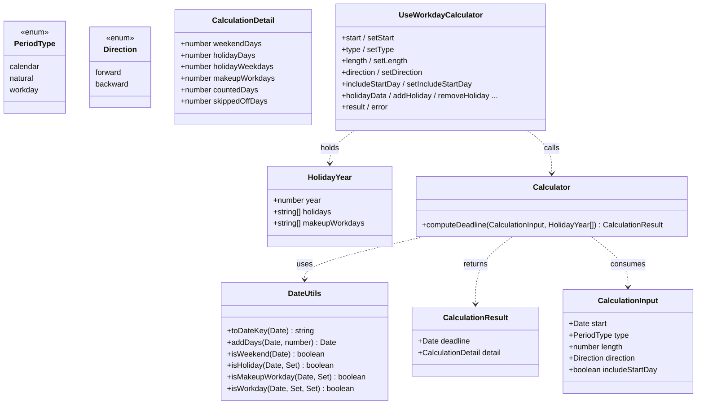
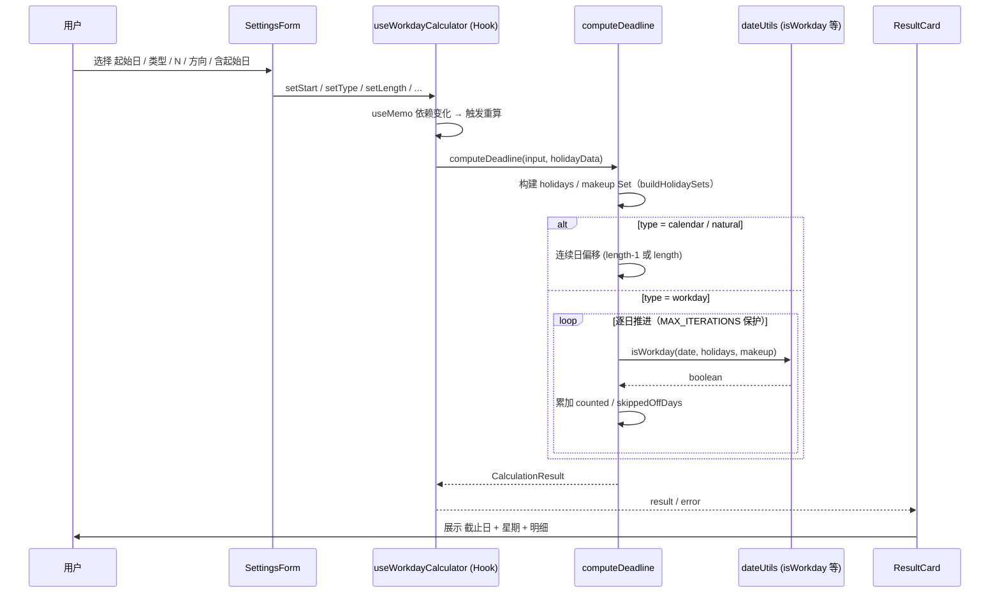
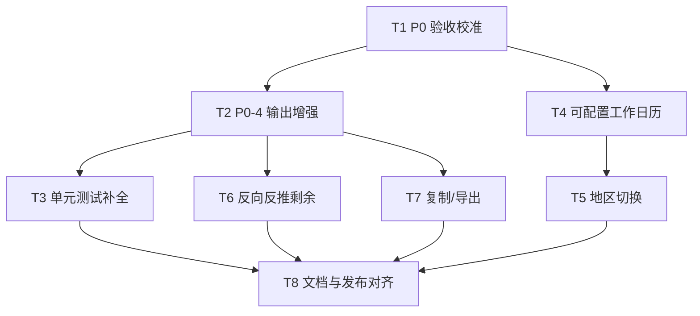

# 系统架构设计文档（ARCHITECTURE）

| 字段 | 内容 |
| --- | --- |
| 文档版本 | v1.0 |
| 架构师 | 高见远（Bob） |
| 创建日期 | 2026-06-17 |
| 对应 PRD | `/workspace/time-calculator/PRD.md`（v1.0 草稿，许清楚） |
| 评估对象 | 现有代码 `/workspace/time-calculator/src/` |
| 文档状态 | 评审中 |

> 本文档目标：在评估现有实现与 PRD 差距的基础上，给出实现方案、文件结构、接口契约、调用流程、任务列表与待明确事项，供工程师（Engineer）与产品（Alice）/主理人评审。

---

## 1. 实现方案与框架选型

### 1.1 需求难点分析

| 难点 | 说明 | 现有方案评价 |
| --- | --- | --- |
| 工作日计数（跳过周末/节假日、计入补班） | PRD 4.3 规则 1–5，含调休补班日强制计入 | ✅ 已实现，`isWorkday` 逻辑正确 |
| 节假日/调休数据维护 | 需覆盖跨年、年度更新 | ✅ 已解耦为 `src/data/holidays.ts`（2024–2027），结构化可维护 |
| 含/不含起始日口径 | PRD 4.4 边界 | ✅ 已实现（forward/backward + includeStartDay） |
| 单休 / 自定义工作日历（P1-2） | 每周休息日可配 | ❌ 缺失，`isWorkday` 硬编码周末 |
| 地区切换（P1-3） | 多套节假日数据集 | ❌ 缺失，仅中国大陆 |
| 反向计算语义（P1-1） | "给定截止日反推剩余天数" | ⚠️ 部分：仅有「起始 − N」方向，非 PRD 语义 |
| 结果导出（P1-5） | 复制/导出文本或图片 | ❌ 缺失 |
| 剩余日历天数（P0-4） | 从今天到截止日的倒计时 | ❌ 缺失，未展示 |
| 明细具体日期（P0-4） | 途经周末/节假日/补班列出具体日期 | ❌ 缺失，仅展示计数 |

### 1.2 框架与库选型

- **现有选型（已落地）**：Vite + React 18 + TypeScript + Tailwind CSS。核心计算为纯函数（`calculator.ts` / `dateUtils.ts`），与 UI 解耦，便于测试，符合 PRD 非功能需求「准确性 / 纯前端 / 可维护」。
- **PRD 声明选型 vs 实际偏差**：PRD 技术栈写「Vite + React + **MUI** + Tailwind CSS」，但 `package.json` 中**无 `@mui/material` 依赖**，组件全部用原生元素 + Tailwind 实现。**结论**：实际为「Tailwind only」。建议在评审时二选一：① 引入 MUI 并按 MUI 规范重构组件；② 修正 PRD 技术栈为「Vite + React + Tailwind CSS」。**架构师倾向方案 ②**（当前实现轻量、已通过构建与测试，引入 MUI 属无收益重构）。见 §8 待明确事项。
- **单元测试**：当前用 esbuild 打包 `.ts` 后由 `node` 直跑（`tests/algorithm.test.ts` 等），无测试框架。建议后续引入 **Vitest**，与 Vite 同生态、零配置、支持 TS/JSX，降低测试维护成本（非阻断项）。
- **状态管理**：单页应用，仅一个计算器，用 `useState` + `useMemo` 即足够，无需 Redux/Zustand。

### 1.3 架构模式

采用 **MVU/MVC 轻量分层**：

```
UI 层（components/*）  →  状态/编排层（hooks/useWorkdayCalculator.ts）  →  领域逻辑层（utils/calculator.ts + utils/dateUtils.ts）  →  数据层（data/holidays.ts）
```

- 领域逻辑层为纯函数、无副作用、可单测（满足「可解释 / 准确性」）。
- UI 层通过 Hook 间接调用计算，不直接依赖数据文件（满足「可维护」）。

---

## 2. 文件列表（相对路径）

### 2.1 现有文件（已实现）

| 路径 | 职责 |
| --- | --- |
| `src/main.tsx` | 应用入口（createRoot 渲染 App） |
| `src/App.tsx` | 页面编排（两栏布局：参数设置 / 结果 + 节假日管理） |
| `src/index.css` | Tailwind 指令与全局样式 |
| `src/types.ts` | 类型定义（PeriodType / Direction / HolidayYear / CalculationInput / CalculationDetail / CalculationResult） |
| `src/data/holidays.ts` | 内置节假日/调休数据（2024–2027），含 `dateRange` 辅助与 `defaultHolidayData` |
| `src/utils/dateUtils.ts` | 日期工具（toDateKey / addDays / parseDateKey / isWeekend / isHoliday / isMakeupWorkday / isWorkday / formatDate / weekdayName / buildHolidaySets 等） |
| `src/utils/calculator.ts` | 核心计算入口 `computeDeadline` + 分支（连续日 / 工作日） |
| `src/hooks/useWorkdayCalculator.ts` | 状态管理与计算封装，对外暴露 `UseWorkdayCalculator` |
| `src/components/SettingsForm.tsx` | 参数设置表单（起始时间/类型/方向/长度/含起始日） |
| `src/components/ResultCard.tsx` | 结果与明细展示 |
| `src/components/HolidayEditor.tsx` | 节假日/调休手动管理 |
| `tests/algorithm.test.ts` | 算法 + 组件渲染冒烟测试（45 项断言，已通过） |
| `tests/resultcard.smoke.test.ts` | ResultCard 工作日分支明细渲染冒烟 |
| `package.json` / `vite.config.ts` / `tsconfig.json` / `tailwind.config.js` / `postcss.config.js` / `index.html` | 工程配置 |

### 2.2 规划新增 / 修改文件（见 §5 任务列表）

| 路径 | 变更 | 对应任务 |
| --- | --- | --- |
| `src/types.ts` | 新增 `WorkCalendarConfig`（休息日配置）、`RegionId`、扩展 `CalculationDetail`（明细具体日期）、`CalculationInput`（反向模式字段） | T4 / T5 / T6 |
| `src/utils/dateUtils.ts` | `isWorkday` 改为接收 `WorkCalendarConfig`（可配休息日） | T4 |
| `src/utils/calculator.ts` | 透传 `config`；新增 `countDaysBetween`（反向反推剩余）；收集明细具体日期 | T2 / T4 / T6 |
| `src/data/regions.ts` | **新增**：地区注册表（cn-mainland / hk） | T5 |
| `src/utils/export.ts` | **新增**：`formatResultAsText(result, input)` 供复制/导出 | T7 |
| `src/hooks/useWorkdayCalculator.ts` | 新增 `regionId` / `config` 状态、`today`、`mode`（forward/remaining） | T2 / T4 / T5 / T6 |
| `src/components/SettingsForm.tsx` | 新增休息日/地区/反向模式 UI | T4 / T5 / T6 |
| `src/components/ResultCard.tsx` | 展示剩余日历天数、明细具体日期、导出按钮 | T2 / T7 |
| `PRD.md` | 澄清 AC-1 示例冲突（产品侧） | T1 |
| `README.md` | 技术栈与实际实现对齐 | T8 |

---

## 3. 数据结构与接口契约

### 3.1 现有契约（TypeScript）

```typescript
/** 期限类型。calendar/natural 语义等同；workday 为工作日。 */
export type PeriodType = 'calendar' | 'natural' | 'workday';

/** 计算方向：forward 正向（起始 + N），backward 反向（起始 − N）。 */
export type Direction = 'forward' | 'backward';

/** 单一年度节假日数据。日期用本地 'YYYY-MM-DD' 字符串。 */
export interface HolidayYear {
  year: number;
  holidays: string[];        // 法定休息日（含节假日及连休周末）
  makeupWorkdays: string[];  // 调休补班日（通常为周末上班）
}

/** 计算输入参数。 */
export interface CalculationInput {
  start: Date;               // 起始日期时间
  type: PeriodType;          // 期限类型
  length: number;            // 期限长度（正整数）
  direction: Direction;      // 计算方向
  includeStartDay: boolean;  // 是否包含起始日当天
}

/** 计算明细。 */
export interface CalculationDetail {
  weekendDays: number;       // 经过的周末天数（周六/周日）
  holidayDays: number;       // 经过的法定节假日总天数（含周末）
  holidayWeekdays: number;   // 经过的法定节假日中落在工作日（周一至周五）的天数
  makeupWorkdays: number;    // 经过/计入的调休补班日数量
  countedDays: number;       // 实际计入总天数
  skippedOffDays: number;    // 跳过的非工作日数量（仅工作日模式有意义）
}

/** 计算结果。 */
export interface CalculationResult {
  deadline: Date;
  detail: CalculationDetail;
}

/** 核心计算入口（utils/calculator.ts）。 */
export function computeDeadline(
  input: CalculationInput,
  holidayData: HolidayYear[],
): CalculationResult; // @throws 当 length 非正整数
```

### 3.2 规划契约（P1 增强，草案）

```typescript
/** 工作日历配置（P1-2 单休/自定义）。restDays 为 getDay() 取值：0=周日…6=周六。 */
export interface WorkCalendarConfig {
  restDays: number[];        // 双休默认 [0,6]；单休 [0]；自定义任意组合
}

/** 地区标识（P1-3）。 */
export type RegionId = 'cn-mainland' | 'hk';

/** 地区注册项（P1-3）。 */
export interface HolidayRegion {
  id: RegionId;
  name: string;              // 显示名
  data: HolidayYear[];
  defaultRestDays: number[]; // 该地区默认每周休息日
}

/** 扩展明细：列出途经的具体日期（P0-4 缺口）。 */
export interface CalculationDetail {
  // ...既有字段...
  weekendDateList: string[];     // 途经周末具体日期
  holidayDateList: string[];     // 途经法定节假日具体日期
  makeupDateList: string[];      // 计入/途经调休补班日具体日期
}

/** 反向模式新增：给定截止日，反推剩余（P1-1）。 */
export interface RemainingInput {
  start: Date;     // 起点（通常为今天）
  deadline: Date;  // 截止日
  type: PeriodType;
  config?: WorkCalendarConfig;
}
export function countDaysBetween(input: RemainingInput, holidayData: HolidayYear[]): number;

/** 可配置休息日的工作日判定（P1-2）。 */
export function isWorkday(
  date: Date,
  holidays: Set<string>,
  makeup: Set<string>,
  config?: WorkCalendarConfig, // 缺省 [0,6]
): boolean;
```

### 3.3 类关系图（Mermaid）



---

## 4. 程序调用流程

### 4.1 正向 / 反向计算主流程（时序图）



### 4.2 关键步骤说明（工作日正向，含起始日）

1. 校验 `length` 为正整数（否则抛错，UI 提示）。
2. 将 `holidayData`（多年度）合并为 `holidays` / `makeup` 两个 `Set<string>`（`'YYYY-MM-DD'` 为 key）。
3. 从 `start`（含起始日）起逐日 +1：
   - `isMakeupWorkday` → 强制工作日（即便周末），`makeupWorkdays += 1`，`counted += 1`。
   - `isHoliday` 且非补班 → 跳过，`holidayDays += 1`（工作日则 `holidayWeekdays += 1`）。
   - 否则仅周末跳过（`weekendDays += 1`）。
   - `counted === length` 时记录 `deadline` 并结束。
4. 返回 `{ deadline, detail }`，Hook 经 `useMemo` 缓存，ResultCard 渲染。

> 边界处理已实现：N=0/负数拦截、跨年自动衔接、调休补班日不计周末、起始日=截止日（N=1 且含起始日）。

---

## 5. 任务列表（按实现顺序，含依赖关系）

> 现有代码对 **P0 已覆盖约 85%**（核心引擎扎实，缺 P0-4 的两项展示与 AC-1 校准），对 **P1 仅约 20%**。因此任务以「验证/校准 → P0 缺口补全 → P1 新增模块」为主线。每个任务跨多文件，便于工程师按模块实现。

| ID | 任务名 | 涉及文件 | 依赖 | 优先级 | 说明 |
| --- | --- | --- | --- | --- | --- |
| **T1** | P0 验收校准：澄清 AC-1 冲突并固化正确行为测试 | `tests/algorithm.test.ts`、`tests/resultcard.smoke.test.ts`、`PRD.md`（建议） | — | P0 | 实测 2026-06-17 + 5 工作日 = **2026-06-24**（端午 06-19 法定假被跳过），与 PRD AC-1 的 2026-06-23 **冲突**。算法无误，需产品确认示例窗口或标注"忽略假期"；代码侧补充「端午窗口」正确行为测试，避免回归。 |
| **T2** | P0-4 输出增强：剩余日历天数 + 明细具体日期 | `src/types.ts`、`src/utils/calculator.ts`、`src/hooks/useWorkdayCalculator.ts`、`src/components/ResultCard.tsx` | T1 | P0 | ① 新增 `today` 状态，ResultCard 展示「距今天剩余 N 天」倒计时；② `CalculationDetail` 增加 `weekendDateList / holidayDateList / makeupDateList`，calculator 收集具体日期并展示。 |
| **T3** | P0 单元测试补全：覆盖 PRD 4.4 全部边界 | `tests/algorithm.test.ts`、`tests/resultcard.smoke.test.ts` | T2 | P0 | 补齐 4.4 各边界（N=0、跨年、未来年预估提示、单休+法定假重叠、起始日=截止日、起始日为周末/节假日）的断言，确保 AC-1~AC-7 100% 通过。 |
| **T4** | P1-2 可配置工作日历（单休 / 自定义休息日） | `src/types.ts`、`src/utils/dateUtils.ts`、`src/utils/calculator.ts`、`src/hooks/useWorkdayCalculator.ts`、`src/components/SettingsForm.tsx` | T1 | P1 | `isWorkday` 接收 `WorkCalendarConfig.restDays`（默认 [0,6]，单休 [0]）；法定节假日仍按国家规则排除（优先级高于单休）。SettingsForm 提供休息日勾选。 |
| **T5** | P1-3 地区切换（节假日数据集注册表） | `src/data/regions.ts`（新）、`src/data/holidays.ts`、`src/hooks/useWorkdayCalculator.ts`、`src/components/SettingsForm.tsx` | T4 | P1 | 新增 `regions` 注册表（cn-mainland / hk），Hook 按 `regionId` 选数据集与默认休息日；法定节假日规则全国统一（PRD 4.3 规则 6）。 |
| **T6** | P1-1 反向计算语义对齐（给定截止日反推剩余） | `src/types.ts`、`src/utils/calculator.ts`、`src/hooks/useWorkdayCalculator.ts`、`src/components/SettingsForm.tsx`、`src/components/ResultCard.tsx` | T2 | P1 | 新增 `countDaysBetween(start, deadline, type, config)`，返回「还需多少工作日/日历日」；与现有 `direction=backward`（起始−N）区分，UI 增加「反推剩余」模式。 |
| **T7** | P1-5 结果复制 / 导出 + 移动端复查 | `src/utils/export.ts`（新）、`src/components/ResultCard.tsx`、`src/index.css` | T2 | P1 | 新增 `formatResultAsText` 生成可复制文本（含截止日/星期/明细）；ResultCard 增加「复制」按钮；复查移动端自适应（PRD 可用性 NFR）。 |
| **T8** | 文档与发布对齐（技术栈确认 + 文档同步） | `ARCHITECTURE.md`（本文件）、`README.md`、`package.json` | T1–T7 | P2 | 澄清 MUI 偏差（采用 Tailwind only 并更新 PRD）、同步 README 功能清单与已知限制、补充 2027 预估提示文案。 |

### 5.1 依赖关系图（Mermaid）



---

## 6. 依赖包列表

### 6.1 现有依赖（来自 `package.json`）

```
# 运行时依赖
react@^18.3.1           # UI 框架
react-dom@^18.3.1       # React DOM 渲染

# 开发依赖
@types/react@^18.3.12
@types/react-dom@^18.3.1
@vitejs/plugin-react@^4.3.4
autoprefixer@^10.4.20
postcss@^8.4.49
tailwindcss@^3.4.15
typescript@^5.6.3
vite@^5.4.11
```

### 6.2 建议新增（非阻断，待评审）

```
vitest@^2        # 测试框架（替代裸 esbuild+node，TS/JSX 零配置，与 Vite 同生态）
@mui/material     # 仅当评审决定采用 PRD 原技术栈时引入（架构师倾向不引入）
```

> 注：当前测试用 esbuild 打包 `.ts` 后 `node` 执行（`tests/algorithm.test.ts` 顶注释已说明），可继续沿用，不强制引入 Vitest。

---

## 7. 共享知识与跨文件约定

- **日期表示**：跨文件统一用本地 `'YYYY-MM-DD'` 字符串作为节假日数据的 key（`toDateKey` / `parseDateKey` 互转）；内部计算用 `Date`（本地零点，避免时区偏移）。
- **节假日数据形态**：`HolidayYear[]`，每年 `holidays` 与 `makeupWorkdays` 互不重叠；`makeupWorkdays` 应全部落在周末（测试 section 8 已校验）。新增地区/年份时须保持该不变量。
- **工作日判定契约**（核心不变式）：`isWorkday = 补班日恒 true；否则 法定假 false；否则 非休息日`。单休/地区增强后，该契约保持，仅「休息日」来源由硬编码 `[0,6]` 改为 `WorkCalendarConfig.restDays`。
- **国家节假日规则统一**：无论单休还是地区切换，法定节假日/补班一律按内置数据集排除/计入，不因子配置而改变（PRD 4.3 规则 6，4.4「单休+法定假重叠」）。
- **输入校验**：`computeDeadline` 在 `length` 非正整数时抛 `Error('期限长度必须为正整数')`；Hook 的 `setLength` 会先 `Math.floor` 并 clamp≥1，UI 通过 `error` 字段展示。`MAX_ITERATIONS=100_000` 防止异常输入死循环。
- **含/不含起始日**：连续日整体偏移 `length-1`（含）或 `length`（不含）；工作日从起始日（含）或次日（不含）起计数。
- **结果缓存**：计算放在 Hook 的 `useMemo` 中，依赖 `start/type/length/direction/includeStartDay/holidayData`，避免重复计算。
- **可解释性**：每次结果均带 `CalculationDetail` 明细，禁止"黑盒"输出。

---

## 8. 现有代码与 PRD 的差异分析

### 8.1 覆盖度总览

| PRD 条目 | 现状 | 差距 |
| --- | --- | --- |
| P0-1 日历日/自然日 | ✅ 实现（含/不含起始日均正确） | 无 |
| P0-2 工作日（跳过周末+法定假） | ✅ 实现 | 无 |
| P0-3 内置中国大陆节假日+调休计入 | ✅ 实现（2024–2027） | 无 |
| P0-4 结构化输出 | ⚠️ 部分 | **缺「剩余日历天数」与「明细具体日期列表」** |
| P0-5 输入校验 | ⚠️ 基本 | 起始日恒为合法 Date，无「为空」显式路径；N/类型校验到位 |
| P1-1 反向计算 | ⚠️ 偏差 | 仅有「起始−N」方向，非 PRD「给定截止日反推剩余」语义 |
| P1-2 单休/自定义工作日历 | ❌ 缺失 | `isWorkday` 硬编码周末 |
| P1-3 地区切换 | ❌ 缺失 | 仅中国大陆，无注册表 |
| P1-4 起始日落在周末/节假日计数可配 | ⚠️ 部分 | includeStartDay 已支持；「起始日强制计入」开关未独立提供 |
| P1-5 复制/导出 | ❌ 缺失 | 无 |
| P2-1 批量 / P2-2 智能解析 / P2-3 日历可视化 / P2-4 数据自动更新 | ❌ 缺失 | 后续增强 |
| NFR 国际化（中英文） | ❌ 缺失 | 仅中文 |
| NFR 技术栈（MUI） | ⚠️ 偏差 | **PRD 写 MUI，实际 Tailwind only（无 @mui 依赖）** |

### 8.2 关键差异详解

**差异 A（高优先级，正确性冲突）—— AC-1 验收示例 vs 内置节假日数据**
- PRD AC-1：起始 `2026-06-17`（周三）、`workday`、N=5 → 期望 `2026-06-23`（周二），途经周末 2 天。
- 实测（按现有算法 + `data/holidays.ts` 2026 数据）：`2026-06-19`（周五）为**端午法定假**（数据含 `dateRange('2026-06-19','2026-06-21')`），被跳过，第 5 个工作日实际落在 **`2026-06-24`（周三）**。
- 根因：PRD AC-1 示例窗口恰好覆盖端午假期，示例未考虑该假期，属 **PRD 示例与真实数据冲突**，非算法错误。
- 影响：若直接以 PRD AC-1 为验收基准，自动化测试会失败。
- 建议：① 产品将 AC-1 改为无假期干扰窗口（如 `2026-03-02` 周三起 5 工作日 → `2026-03-08` 周一，需复核）；或 ② 明确标注「示例忽略假期干扰」。代码逻辑保持正确，仅需固化正确行为测试（T1）。

**差异 B（P0 缺口）—— P0-4 展示不全**
- PRD 要求输出「剩余日历天数（从今天到截止日倒计时）」与「途经周末/节假日/补班具体日期列表」。
- 现状：ResultCard 仅展示计数（weekendDays / holidayWeekdays / makeupWorkdays 等），**无剩余天数、无具体日期列表**。
- 处理：T2 补全。

**差异 C（技术栈偏差）—— MUI 未使用**
- PRD 技术栈声明含 MUI，实际 `package.json` 无 `@mui/material`，组件用原生元素 + Tailwind。
- 处理：架构师建议保留 Tailwind only（已可用、轻量），在评审中更新 PRD 技术栈；除非主理人明确要求 MUI（T8）。

**差异 D（P1-1 语义偏差）—— 反向计算**
- PRD P1-1：「给定截止日期与口径，反推还需多少个工作日/日历日」（已知终点求剩余）。
- 现状：`direction='backward'` 是「从起始日反向推进 N 天」（已知起点与 N 求终点），与 P1-1 不同。
- 处理：T6 新增 `countDaysBetween` 实现 P1-1 语义，保留 backward 作为另一能力。

**差异 E（小增强）—— `natural` 类型**
- 代码提供 `calendar` / `natural` / `workday` 三选项，PRD 输入枚举仅列 `calendar`/`workday`（`natural` 作为 `calendar` 同义词）。现状将两者在 UI 区分但计算等价，属合理增强，非缺口。

---

## 9. 待明确事项（Open Questions）

1. **AC-1 冲突如何处置（差异 A）**：产品是否改用无假期窗口，或标注"示例忽略假期"？需 Alice/主理人确认，否则验收测试无法对齐。
2. **MUI 是否引入（差异 C）**：采用 Tailwind only（架构师建议）还是引入 MUI 重构组件？影响 T8 与未来组件规范。
3. **单休语义确认（PRD 待确认问题 2）**：确认「单休仅改每周休息日（仅周日），法定节假日全国统一排除」——与现有 `isWorkday` 契约一致，T4 据此实现。
4. **地区范围（PRD 待确认问题 5）**：首版是否仅需中国大陆 + 香港？决定 `regions.ts` 初始注册项。
5. **P1-1 / P1-5 是否进首版（PRD 待确认问题 4）**：当前 PRD 标为 P1（Should Have）。若排期紧张，可后置 T6/T7，但 T2/T4/T5 建议保留。
6. **剩余天数基准**：「从今天到截止日」的"今天"是否取用户设备本地日期？是否需考虑用户指定的起始日而非真实今天？（建议取真实今天，与 PRD「用于倒计时提示」一致。）
7. **2027 预估数据**：数据文件已标注 2027 为预估，是否需要在 UI 显式提示"该年数据待官方公布"？（PRD 4.4 边界要求，可在 ResultCard/footer 增加提示，T2/T8 考虑。）

---

## 10. 结论与下一步建议

- **满足度评估**：现有代码**核心计算引擎扎实、P0 主体已实现（≈85%）**，单元测试已覆盖多数算法路径（45 项断言通过）。主要差距为 **P0-4 展示缺口（剩余天数/具体日期）**、**AC-1 验收示例冲突**，以及 **P1-2 / P1-3 / P1-5 功能缺失**。
- **主理人建议**：
  1. 立即推进 **T1**（澄清 AC-1），避免验收返工；
  2. 优先 **T2/T3** 补全 P0-4 与边界测试，确保 AC-1~AC-7 全绿；
  3. P1 按 **T4→T5→T6→T7** 顺序增量交付，依赖链清晰、可独立测试；
  4. 评审时拍板 **MUI 偏差（待明确 2）** 与 **地区范围（待明确 4）**。
- 整体重构风险低：领域逻辑层（纯函数）设计良好，P1 增强以「扩展参数 / 新增函数 / 新增地区注册表」为主，无需大规模重写。
